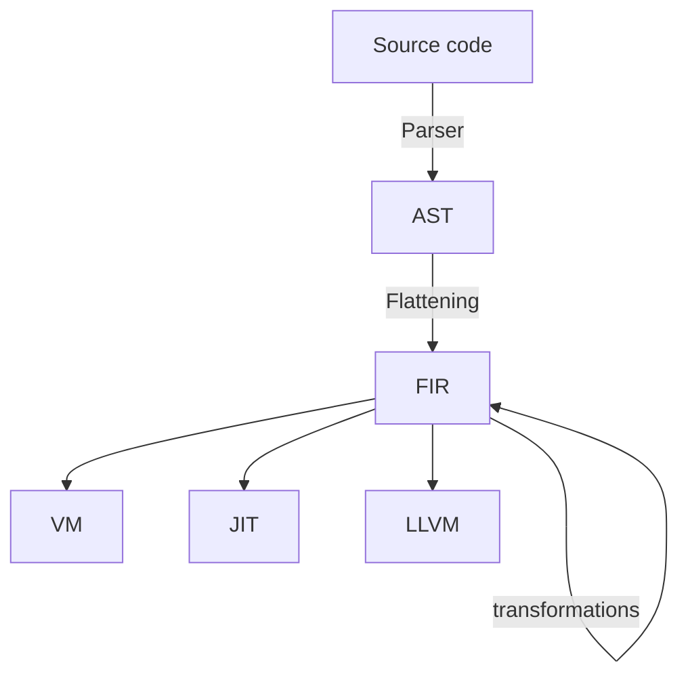
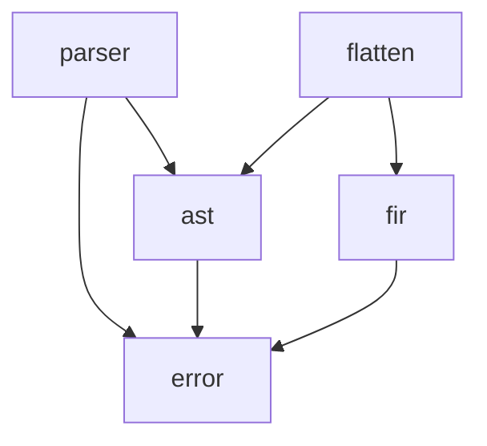

# `jinko`'s new internal representation

## Existing one?

- Parser -> Instruction -> does everything!
- Even the execution!

## Overall design



This would maybe enable us to have more different crates within the interpreter?

An arrow indicates a dependency. Theoretically, this shows that we won't have any cyclic dependency.



## Parser

- No changes
- Parse the file and create an instance of AST

## AST

```rust
enum Ast {
		Block(Vec<Box<Ast>>),
		Function {
				name: Symbol,
				generics: Vec<Symbol>,
				arguments: Vec<TypedValue>,
				block: Box<Ast>,
		},
		Type {
				name: Symbol,
				fields: Vec<TypedValue>,
				with: Option<Box<Ast>>
		},
		Call {
				to: Symbol,
				generics: Vec<GenericApplication>,
				args: Vec<Box<Ast>>,
		},
		Declaration {
				mutable: bool,
				name: Symbol,
				value: Box<Ast>,
		},
		Var(Symbol),
		VarOrType(Symbol),
		/* etc... */
}
```

- An enum which represents the source code quite faithfully
- No name resolution
- No generic expansion
- Help create the FIR context

## FIR

- Immutable
- As small as possible (uses references/IDs inside a big context/map structure)
- Multiple passes 
- Multiple verification steps? Like making sure that past a certain point, there are no longer any `VarOrType` instances

The goal is to have a `jinko` interpreter look something like that:

```rust
fn main() -> Result<(), jinko::error::Error> {
		let ast = jinko::Parser::parse(/* ... */);
		
		/* AstExt from flatten crate, or different ergonomic */
		let fir = ast.flatten();
		
		let fir = fir.name_resolve()
				.monomorphize()
				.fold()
				.optimize();
				
		jinko::VirtualMachine::new().run(fir)
}
```

### Flattening

- `flatten` crate
- Takes an AST and outputs an FIR -> first pass
- Removing scopes
		- How?

### FIR-e, the FIR-evaluator

- For constant folding? Or go through the VM? Or is that the VM?

## Backend

### Virtual Machine

- Just run FIR-e on the whole thing?

### JIT, Compiler

Upcoming...
